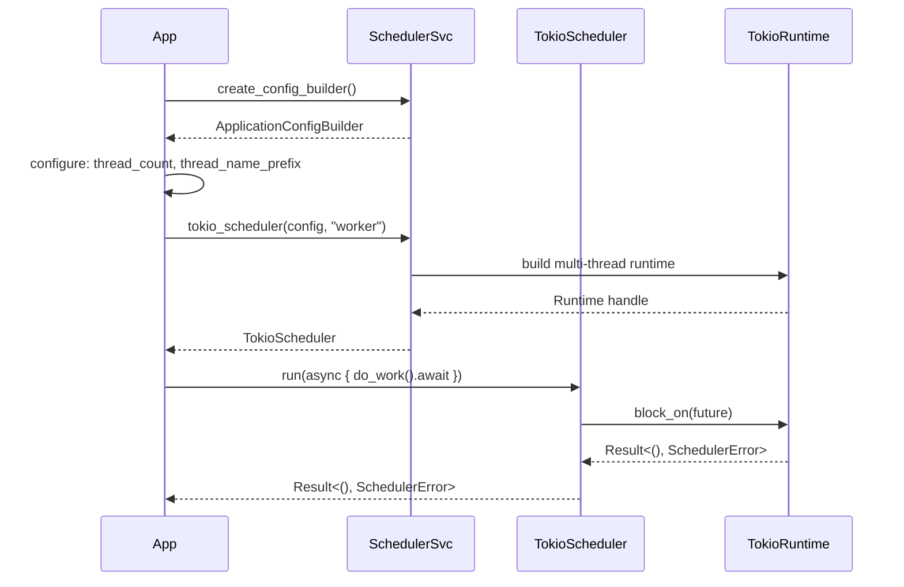
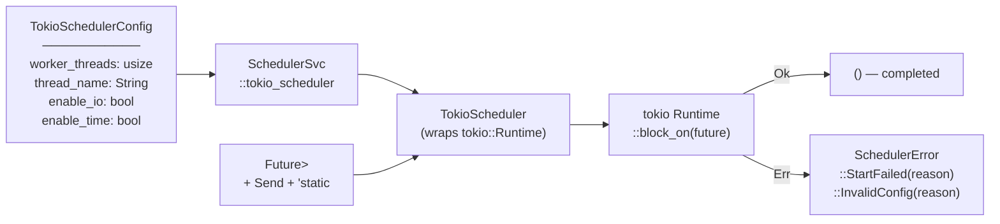

# Architecture — edge-scheduler

## Sequence

> The caller creates a `TokioScheduler` via `SchedulerSvc`, submits a future via `run()`, and the scheduler blocks the calling thread until the future completes or the runtime shuts down.

## Data Flow

> A `Future` enters `Scheduler::run`; the tokio multi-thread runtime drives it to completion; `Result<(), SchedulerError>` exits.

